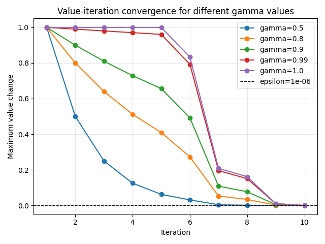

# Tic-Tac-Toe RL

Learning Reinforcement Learning from scratch by implementing a Tic-Tac-Toe environment and solving it using Dynamic Programming and Model-Free methods.

## TODOs

- [x] Defining MDP tuple
  - State
  - Action
  - Transition Probability
  - Reward
  - γ (Discount Factor)

- [x] Defining functions
  - `step(action)`
  - Hashable state representation

- [x] Random move bot

- [x] Value Iteration (DP)

- [ ] Policy Iteration (DP)

- [ ] Q-Function (Model-Free)

- [x] Reward graph and convergence time analysis

## Reward Structure

| Outcome | Reward |
|----------|----------|
| Win | +1 |
| Draw | 0 |
| Loss | -1 |
| Wrong Move | -10 |

## Notes

Value Function:

Vπ(s) = E[ Σ γᵗ rₜ | s ]

Bellman Equation:

V(s) = max E(r + γV(s'))

The optimal policy is the one that maximizes this expression at every state.

## Reward Graph + Convergence Time

Comparison of different γ values and their effect on reward and convergence.